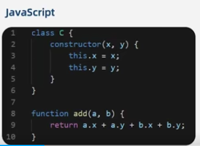
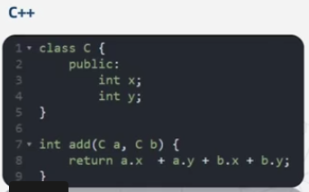
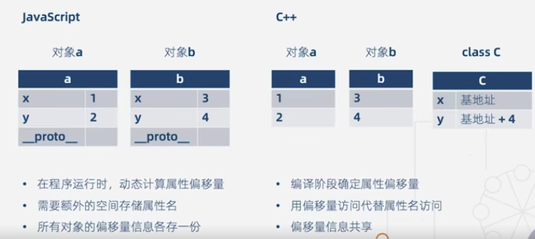
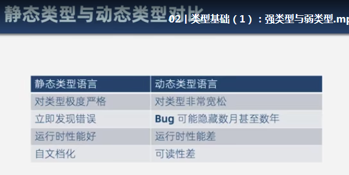
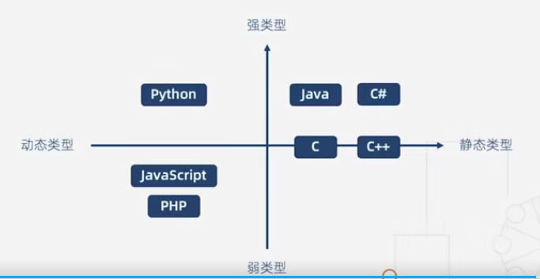
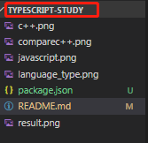

# Table of Content
* [重塑类型思维](#重塑类型思维)  
    * [为什么使用typescript](#为什么使用typescript)  
* [基础类型(1):强类型与弱类型](#基础类型(1):强类型与弱类型)  
* [基础类型(2):动态类型与静态类型](#基础类型(2):动态类型与静态类型)  
* [编写你的第一个typescript程序](#编写你的第一个typescript程序)  
    * [类型注解](#类型注解) 

## 重塑类型思维  
- 类型检查
- 语言扩展
- 工具属性 
### 为什么使用typescript?
vscode具备强大的自动补全，导航和重构功能，这使得接口定义可以直接代替文档，提高开发效率，降低维护成本。帮助团队重塑类型思维  
## 基础类型(1):强类型与弱类型  
- 静态类型语言与动态类型语言
    静态类型预言：在编译阶段确定所有变量的类型  
    动态类型语言：在执行阶段确定所有变量的类型  
      
    js只有在执行的时候才会知道a,b的变量类型  
      
    c++在编译的时候就知道a,b的变量类型，而且类型一定是整型  
     
    总结：动态类型的语言无论是在时间还是空间都有比较多的性能损耗  
       
     - 动态类型语言的支持者认为：  
     - 性能是可以改善的（V8引擎），而语言的灵活性更重要  
     - 隐藏的错误可以通过单元测试发现  
     - 文档可以通过工具生成  
     其它定义：  
     强类型语言：不允许程序发生错误后继续执行  
     争议：C/C++是强类型还是弱类型？  
     按照这个定义c++就变成弱类型的语言，因为他们没有对数组越界进行检查，可能导致程序的崩溃。本课程按照的是通俗的定义，即静态类型预言：在编译阶段确定所有变量的类型。动态类型语言：在执行阶段确定所有变量的类型  
     语言类型象限图：  
       
     思考题：如果把typescript当做一门语言来看待，那么它是强类型语言还是弱类型语言，是静态类型语言还是动态类型语言呢？  
## 基础类型(2):动态类型与静态类型
简单的配置：  
- 新建文件夹  
  
- 初始化工程   
    npm init -y  
- 安装typescript    
    npm i typescript -g  
- 创建配置项  
    tsc --init  
- 编译文件  
    tsc 文件所在目录  
- 配置构建工具webpack
   1.安装三个包（为了更快，先转成淘宝镜像）  
   $ npm install -g cnpm --registry=https://registry.npm.taobao.org //多数情况下使用此命令即可切换  
   $cnpm i webpack webpack-cli webpack-dev-server -D
   分别书写开发环境和生产环境，然后在通过插件合并  
   2.安装ts-loader  
   $cnpm i ts-loader typescript -D  
   3.安装html-webpack-plugin  
   $cnpm i html-webpack-plugin -D  
   4.安装clean-webpack-plugin  
   $cnpm i clean-webpack-plugin -D  
   帮助每次成功构建之后，清除dist目录  
   5.安装webpack-merge，作用是把两个配置文件合并
   $cnpm i webpack-merge -D
## 编写你的第一个typescript程序
   ES6的数据类型
       - Boolean
       - Number  
       - String  
       - Array  
       - Function  
       - Object  
       - Symbol  
       - undefined  
       - null  
    TypeScript的数据类型
       - Boolean
       - Number  
       - String  
       - Array  
       - Function  
       - Object  
       - Symbol  
       - undefined  
       - null  
       - void  
       - any  
       - nerver  
       - 元组  
       - 枚举  
       - 高级类型  
### 类型注解       
作用：相当与强类型语言中的类型声明  
语法：（变量/函数）：type  
查看datatype.ts上的笔记  
undefined和null是任何类型的子类型，说明undefined和null可以被赋值给其它类型，如果不行。需要修改一下tsconfig.json上的配置将"strictNullChecks"改为 false。如果想要使用比较严格的语法就可以把它关闭掉

