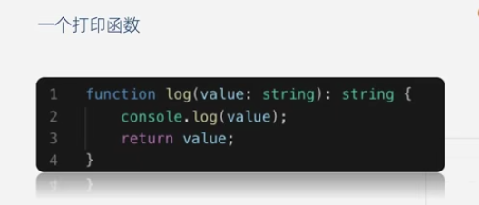

# Table of Content
* [重塑类型思维](#重塑类型思维)  
    * [为什么使用typescript](#为什么使用typescript)    
* [基础类型:强类型与弱类型](#基础类型:强类型与弱类型)    
* [基础类型:动态类型与静态类型](#基础类型:动态类型与静态类型)  
* [编写你的第一个typescript程序](#编写你的第一个typescript程序)  
    * [类型注解](#类型注解)  
* [基本类型](#基本类型) 
* [接口](#接口)  
    * [对象类型的接口](#对象类型的接口)  
    * [函数类型的接口](#函数类型的接口)   
 * [ts中与函数相关的知识点](#ts中与函数相关的知识点)  
* [ts中的类](#ts中的类)  
    * [抽象类与多态](#抽象类与多态)  
* [类与接口](#类与接口)
* [泛型](#泛型)  
    * [泛型函数与泛型接口](#泛型函数与泛型接口)
    * [泛型类与泛型约束](#泛型类与泛型约束)   

## 重塑类型思维  
- 类型检查
- 语言扩展
- 工具属性 
### 为什么使用typescript?
vscode具备强大的自动补全，导航和重构功能，这使得接口定义可以直接代替文档，提高开发效率，降低维护成本。帮助团队重塑类型思维  
## 基础类型:强类型与弱类型  
- 静态类型语言与动态类型语言
    静态类型预言：在编译阶段确定所有变量的类型  
    动态类型语言：在执行阶段确定所有变量的类型  
      
    js只有在执行的时候才会知道a,b的变量类型  
      
    c++在编译的时候就知道a,b的变量类型，而且类型一定是整型  
     
    总结：动态类型的语言无论是在时间还是空间都有比较多的性能损耗  
       
     - 动态类型语言的支持者认为：  
     - 性能是可以改善的（V8引擎），而语言的灵活性更重要  
     - 隐藏的错误可以通过单元测试发现  
     - 文档可以通过工具生成  
     其它定义：  
     强类型语言：不允许程序发生错误后继续执行  
     争议：C/C++是强类型还是弱类型？  
     按照这个定义c++就变成弱类型的语言，因为他们没有对数组越界进行检查，可能导致程序的崩溃。本课程按照的是通俗的定义，即静态类型预言：在编译阶段确定所有变量的类型。动态类型语言：在执行阶段确定所有变量的类型  
     语言类型象限图：  
       
     思考题：如果把typescript当做一门语言来看待，那么它是强类型语言还是弱类型语言，是静态类型语言还是动态类型语言呢？  
## 基础类型:动态类型与静态类型
简单的配置：  
- 新建文件夹  
  
- 初始化工程   
    npm init -y  
- 安装typescript    
    npm i typescript -g  
- 创建配置项  
    tsc --init  
- 编译文件  
    tsc 文件所在目录  
- 配置构建工具webpack
   1.安装三个包（为了更快，先转成淘宝镜像）  
   $ npm install -g cnpm --registry=https://registry.npm.taobao.org //多数情况下使用此命令即可切换  
   $cnpm i webpack webpack-cli webpack-dev-server -D
   分别书写开发环境和生产环境，然后在通过插件合并  
   2.安装ts-loader  
   $cnpm i ts-loader typescript -D  
   3.安装html-webpack-plugin  
   $cnpm i html-webpack-plugin -D  
   4.安装clean-webpack-plugin  
   $cnpm i clean-webpack-plugin -D  
   帮助每次成功构建之后，清除dist目录  
   5.安装webpack-merge，作用是把两个配置文件合并
   $cnpm i webpack-merge -D
## 编写你的第一个typescript程序
   ES6的数据类型
       - Boolean
       - Number  
       - String  
       - Array  
       - Function  
       - Object  
       - Symbol  
       - undefined  
       - null  
    TypeScript的数据类型
       - Boolean
       - Number  
       - String  
       - Array  
       - Function  
       - Object  
       - Symbol  
       - undefined  
       - null  
       - void  
       - any  
       - nerver  
       - 元组  
       - 枚举  
       - 高级类型  
### 类型注解       
作用：相当与强类型语言中的类型声明  
语法：（变量/函数）：type  
查看datatype.ts上的笔记  
undefined和null是任何类型的子类型，说明undefined和null可以被赋值给其它类型，如果不行。需要修改一下tsconfig.json上的配置将"strictNullChecks"改为 false。如果想要使用比较严格的语法就可以把它关闭掉
## 基本类型
一个角色判断的例子    
  
 问题：  
 1）可读性差：很难记住数字的含义  
 2）可维护差：硬编码，牵一发而动全身  
 ### 枚举  
 [枚举](https://www.tslang.cn/docs/handbook/enums.html) 
枚举： 一组有名字的常量集合  
可以理解为通讯录里面的电话号码，记住名字就可以了，电话号码是可以改变的，人名基本是不会改变的  
使用枚举很简单：通过枚举的属性来访问枚举成员，和枚举的名字来访问枚举类型  
提问：什么是反向映射？  
枚举掌握思维方法要求：将程序中不容易进记忆的硬编码，或者是未来中可能改变的常量，抽取出来，定义成枚举类型，提高程序的可读性和可维护性  
作业：将角色判断改成枚举类型
## 接口  
[接口](https://www.tslang.cn/docs/handbook/interfaces.html) 
接口：接口可以用来约束对象，函数，类的结构以及类型，这是一种代码协作的契约，我们必须遵守，而且不能改变  
### 对象类型的接口
一个对象类型的接口是如何定义的？看src/partone_base/interfaceone.ts  
### 函数类型的接口  
查看src/partone_base/interface_fun.ts   
## ts中与函数相关的知识点  
梳理函数知识点，包括如何定义一个函数，包括对函数参数的类型，个数有什么要求，和函数重载的定义  
## ts中的类  
es6中引入了class关键字，我们可以像传统的面向对象语言那样去创建一个类了。总体上来讲，ts中的类覆盖了js中的类，同时也引入了一些其它的特性，在本课程当中会着重比较两者当中的不同。这节课来学习类的继承和成员修饰符。  
本节课主要讲类的基本知识，包括类的基本实现，类的继承
查看src/partone_base/class.ts  
### 抽象类与多态 
es中并没有引入抽象类的概念，这是es对ts的又一次扩展。抽象类就是只能被继承而不能被实例化的类  
查看src/partone_base/class.ts   
## 类与接口
    结合类与接口的知识，缕清一下他们之间的关系  
       
     接口之间是可以相互继承的，实现接口的复用，类之间也可以相互继承，可以实现方法和属性的复用，接口可以通过类来实现，但是  
     接口只能约束类的公有成员，另外接口也可以抽离出类的成员，抽离的时候会包括公有成员，私有成员和受保护成员。
## 泛型  
### 泛型函数与泛型接口  
    很多时候我们希望一个函数或者一个接口可以支持多种数据类型，有很大的灵活性，举例：  
      
    希望这个函数能够接收一个字符串数组，怎么做？函数重载  
      
    联合类型  
      
    更进一步，希望函数可以接收任何类型的参数  
      
    我们会发现any类型丢失了一些约束信息，也就是类型之间的约束关系，它忽略了输入参数的类型和函数返回值的类型必须是一致的  
    泛型：不预先确定的数据类型，具体的类型在使用的时候才能确定  
### 泛型类与泛型约束
    泛型也可以约束类的成员  
      
    泛型的好处  
    - 函数和类可以轻松地支持多种类型，增强程序的扩展性  
    - 不必写多条函数重载，冗长的联合类型声明，增强代码可读性  
    - 灵活控制类型之间的约束